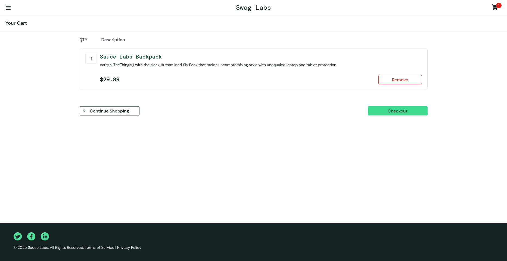
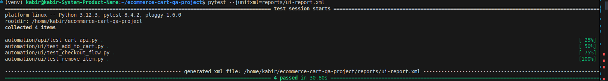

# 🛒 E-commerce Cart QA Automation Project

A complete **Manual + Automated QA Project** for testing an e-commerce shopping cart.  
Includes **UI Automation (Playwright + Pytest)**, **API testing**, **manual test cases**, and **CI/CD with GitHub Actions**.

---

## 🚀 Features

### ✅ UI Automation (Playwright)
- Login  
- Add product to cart  
- Remove product  
- Checkout flow  
- Assertions for cart count and page navigation  

### 🔌 API Testing
- Simple user-creation API test  
- Validates status codes & response structure  

### 🧪 Manual Testing
- Includes Excel test case suite:  
  `manual-tests/test-cases-cart.xlsx`

### 🔄 Continuous Integration (CI/CD)
- All tests run automatically in GitHub Actions  
- Test results uploaded as downloadable artifacts  

---

## 📁 Project Structure

```

ecommerce-cart-qa-project/
│
├── automation/
│   ├── api/
│   │   └── test_cart_api.py
│   └── ui/
│       ├── test_add_to_cart.py
│       ├── test_checkout_flow.py
│       └── test_remove_item.py
│
├── manual-tests/
│   └── test-cases-cart.xlsx
│
├── assets/
│   └── screenshots/
│       ├── cart-page.png
│       └── test-pass-terminal.png
│
├── reports/              ← local reports (ignored by Git)
├── .github/workflows/
│   └── ci-tests.yml
├── conftest.py
├── requirements.txt
└── README.md

````

---

## 📸 Screenshots

### 🛍️ Cart Page Under Test
(Replace the filename once you upload your screenshot)

```markdown

````

### 🟢 All Tests Passing (Terminal Output)

```markdown

```

---

## 🧪 Running Tests Locally

### 1. Install dependencies

```bash
pip install -r requirements.txt
playwright install
```

### 2. Run all tests

```bash
pytest --junitxml=reports/ui-report.xml
```

### 3. View report locally

Open:

```
reports/ui-report.xml
```

Use any JUnit viewer (or VS Code extension).

---

## ☁️ Running Tests in GitHub Actions

This project includes a full CI workflow:

```
.github/workflows/ci-tests.yml
```

Every push automatically:

* Installs dependencies
* Installs Playwright browsers
* Runs all UI + API tests
* Uploads the **JUnit Report** as a downloadable artifact

---

## 📥 How to Download Test Reports (GitHub Actions)

1. Go to your repository on GitHub
2. Click on the **Actions** tab
3. Select the latest workflow run
4. Scroll down to the **Artifacts** section
5. Click **junit-report** to download `ui-report.xml`

🎉 You now have the test results from the CI pipeline.

---

## 🎯 Technologies Used

* **Python 3.12**
* **Playwright**
* **Pytest**
* **Requests**
* **GitHub Actions**
* **Excel (Manual test cases)**

---

## 🏁 Summary

This project demonstrates end-to-end QA capability:

* Manual test case design
* UI automation
* API testing
* CI/CD integration
* Clean repo structure
* Professional documentation
